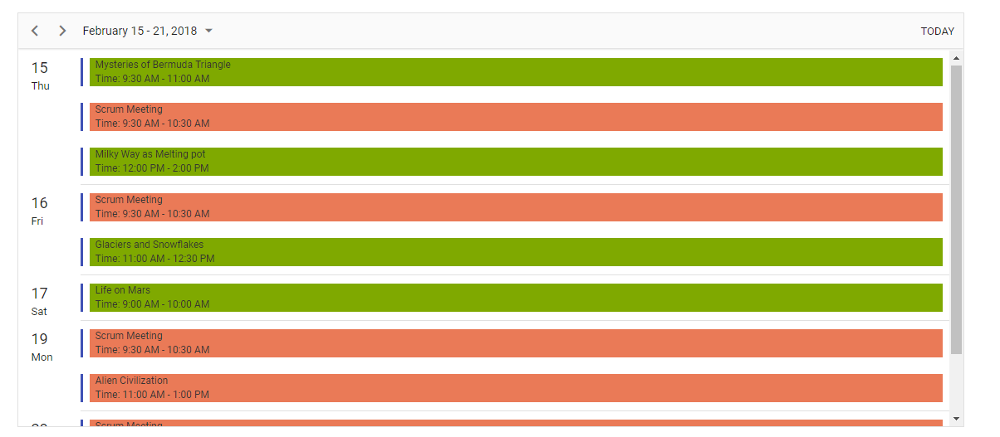

# How to customize the event background color in agenda view?
An example application that shows how to customize the event background color in Agenda view of Scheduler.

## How to run this application?

1. You need to first clone the `how-to-customize-the-event-background-color-in-agenda-view` repository and then navigate to its appropriate path where it has been located in your system.
2. Build your project to restore the packages and then run the application.